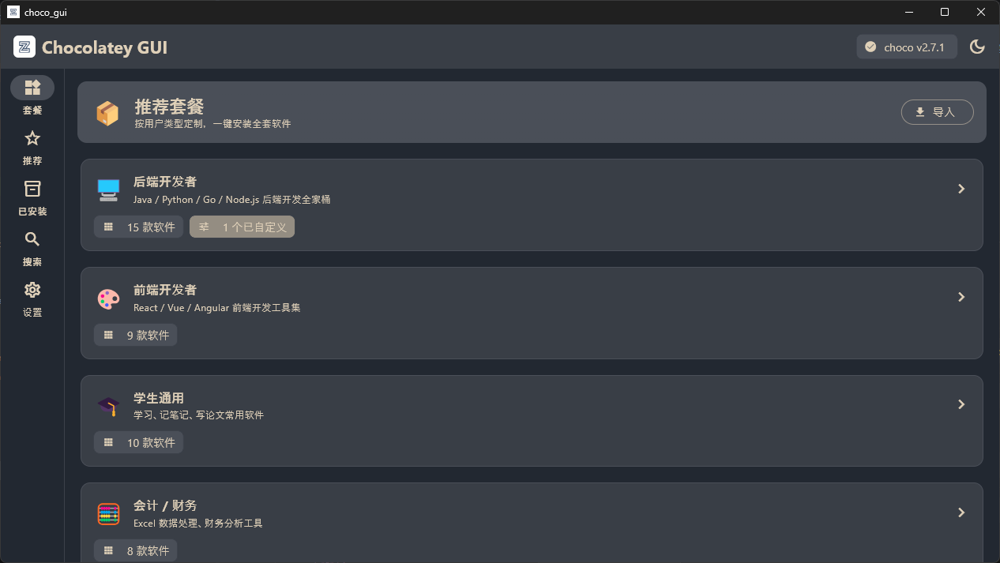
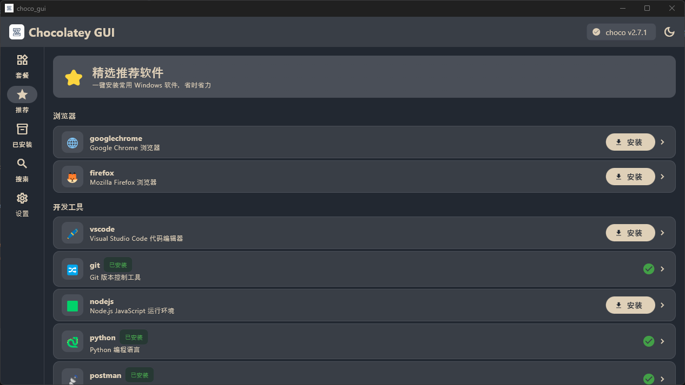
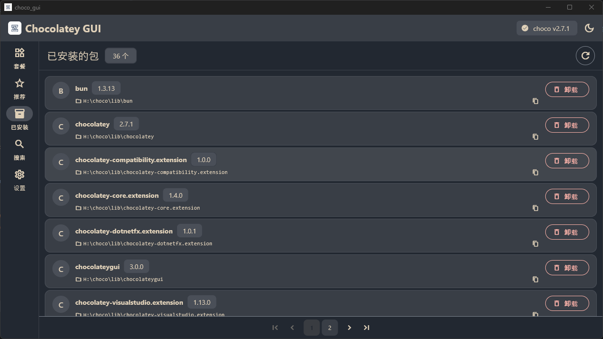
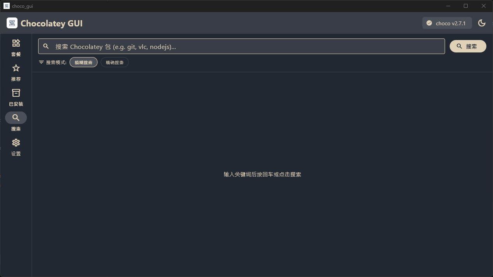
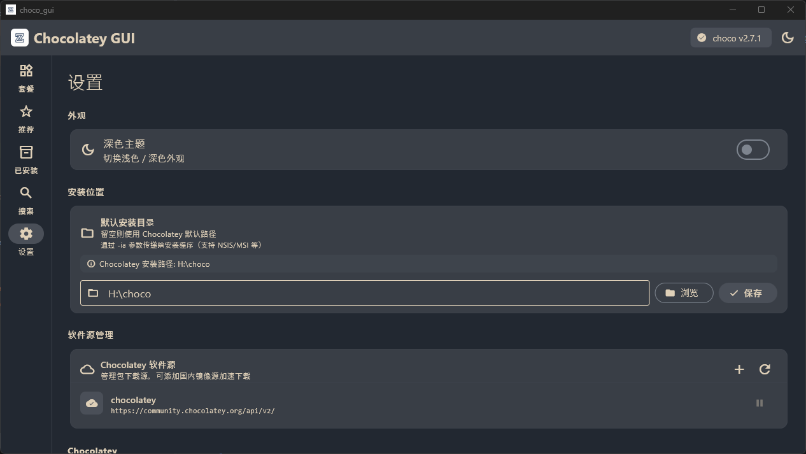

<div align="center">


# Choco GUI

**基于 Flutter 构建的现代化 Chocolatey 包管理器图形界面**

[](https://flutter.dev)
[](https://www.microsoft.com/windows)
[](LICENSE)
[](https://github.com/14752222/choco_gui/releases)

[中文](#中文) · [English](#english)

</div>

---

## 中文

### ✨ 功能特性

| 功能 | 说明 |
|---|---|
| 🔍 **智能搜索** | 支持模糊搜索和精确搜索，基于 `choco search` 实时返回结果 |
| 📦 **包管理** | 安装、卸载软件包，实时操作日志；支持安装历史版本 |
| 🎁 **推荐套餐** | 按用户类型提供预制套餐（前端/后端/设计师等），自由搭配免费/付费选项，一键批量安装 |
| 📋 **配置导入/导出** | JSON 格式导入/导出软件配置，自动验证包可用性，快速复刻开发环境 |
| ⭐ **推荐软件** | 精选常用软件列表，一键快速安装 |
| 🗂️ **软件源管理** | 添加 / 删除 / 启用 / 禁用 Chocolatey 软件源，内置国内镜像提示 |
| 📁 **安装路径** | 自动读取 `$env:ChocolateyInstall`，已安装包可查看并复制安装路径 |
| 🌗 **明暗主题** | 完整 Material 3 主题，采用暖棕配色方案 |
| 🚨 **自动安装 Choco** | 检测到未安装 Chocolatey 时，可一键完成安装；安装失败支持清理缓存重试 |

### 🖼️ 截图







### 🚀 快速开始

#### 环境要求

- Windows 10 / 11（x64）
- [Flutter SDK](https://docs.flutter.dev/get-started/install/windows) ≥ 3.10

#### 下载安装

前往 [Releases](https://github.com/14752222/choco_gui/releases) 下载最新安装包，双击运行即可完成安装。

> ⚠️ 安装/卸载软件包、管理软件源等操作需要**管理员权限**。

#### 从源码运行

```powershell
git clone https://github.com/14752222/choco_gui.git
cd choco_gui
flutter pub get
flutter run -d windows
```

### 🏗️ 项目结构

```
lib/
├── main.dart                     # 入口文件
├── app.dart                      # 根组件与主题定义
├── data/
│   └── bundles/
│       └── bundles.json          # 预制套餐数据
├── models/
│   ├── package_model.dart        # PackageModel 与 ChocoSource 数据类
│   ├── bundle_model.dart         # RecommendedBundle / SoftwareSlot / SoftwareOption
│   └── imported_config.dart      # ImportedConfig 数据类
├── providers/
│   ├── app_provider.dart         # 全局状态管理（InheritedWidget）
│   └── bundle_provider.dart      # 套餐状态管理
├── services/
│   └── choco_service.dart        # 所有 Chocolatey CLI 调用（通过 PowerShell）
├── screens/
│   ├── home_screen.dart          # 主页面（含 NavigationRail）
│   ├── bundles_screen.dart       # 套餐列表页
│   ├── bundle_detail_screen.dart # 套餐详情页
│   ├── import_screen.dart        # 配置导入页
│   ├── recommended_screen.dart   # 推荐软件页
│   ├── installed_screen.dart     # 已安装管理页
│   ├── search_screen.dart        # 搜索页
│   ├── settings_screen.dart      # 设置页
│   └── package_detail_screen.dart# 软件详情页
└── widgets/
    ├── package_card.dart         # 软件卡片组件
    ├── pagination_bar.dart       # 分页组件
    └── progress_dialog.dart      # 进度弹窗组件
```

### 🛠️ 构建

```powershell
# Debug 构建
flutter run -d windows

# Release 构建
flutter build windows --release
# 输出: build\windows\x64\runner\Release\

# 打包安装程序（需要 Inno Setup 6）
iscc installer\choco_gui_setup.iss
# 输出: installer\output\ChocoGUI_Setup_v1.0.0.exe
```

### 🤝 参与贡献

欢迎提交 Issue 和 Pull Request！请先阅读 [CONTRIBUTING.md](CONTRIBUTING.md)。

### 📄 许可证

本项目基于 [MIT 许可证](LICENSE) 开源。

---

## English

### ✨ Features

| Feature | Description |
|---|---|
| 🔍 **Smart Search** | Fuzzy / exact search powered by `choco search`, with real-time results |
| 📦 **Package Management** | Install & uninstall packages with real-time logs; historical version support |
| 🎁 **Software Bundles** | Pre-built bundles by user role (frontend / backend / designer etc.), with free / paid alternatives, one-click batch install |
| 📋 **Import / Export** | JSON-based config import & export, auto-verify package availability, replicate dev environments instantly |
| ⭐ **Recommended Packages** | Curated list of popular packages for quick one-click install |
| 🗂️ **Source Management** | Add / remove / enable / disable Chocolatey sources (supports Chinese mirrors) |
| 📁 **Install Path** | Auto-detect `$env:ChocolateyInstall`; view & copy installed package paths |
| 🌗 **Light / Dark Theme** | Full Material 3 theming with a warm taupe colour palette |
| 🚨 **Auto Chocolatey Setup** | Detect and install Chocolatey automatically; cleanup cache on failure and retry |

### 🖼️ Screenshots


### 🚀 Quick Start

#### Prerequisites

- Windows 10 / 11 (x64)
- [Flutter SDK](https://docs.flutter.dev/get-started/install/windows) ≥ 3.10

#### Download Installer

Go to [Releases](https://github.com/14752222/choco_gui/releases) and download the latest installer. Double-click to install.

> ⚠️ Some operations (installing / uninstalling packages, managing sources) require **Administrator** privileges.

#### Run from source

```powershell
git clone https://github.com/14752222/choco_gui.git
cd choco_gui
flutter pub get
flutter run -d windows
```

### 🏗️ Project Structure

```
lib/
├── main.dart                     # Entry point
├── app.dart                      # Root widget & theme definitions
├── data/
│   └── bundles/
│       └── bundles.json          # Pre-built bundle data
├── models/
│   ├── package_model.dart        # PackageModel & ChocoSource data classes
│   ├── bundle_model.dart         # RecommendedBundle / SoftwareSlot / SoftwareOption
│   └── imported_config.dart      # ImportedConfig data class
├── providers/
│   ├── app_provider.dart         # Global state management (InheritedWidget)
│   └── bundle_provider.dart      # Bundle state management
├── services/
│   └── choco_service.dart        # All Chocolatey CLI calls via PowerShell
├── screens/
│   ├── home_screen.dart          # Main scaffold with NavigationRail
│   ├── bundles_screen.dart       # Bundle list page
│   ├── bundle_detail_screen.dart # Bundle detail page
│   ├── import_screen.dart        # Config import page
│   ├── recommended_screen.dart   # Recommended packages page
│   ├── installed_screen.dart     # Installed packages page
│   ├── search_screen.dart        # Search page
│   ├── settings_screen.dart      # Settings page
│   └── package_detail_screen.dart# Package detail page
└── widgets/
    ├── package_card.dart         # Package card widget
    ├── pagination_bar.dart       # Pagination bar widget
    └── progress_dialog.dart      # Progress dialog widget
```

### 🛠️ Build

```powershell
# Debug build
flutter run -d windows

# Release build
flutter build windows --release
# Output: build\windows\x64\runner\Release\

# Package installer (requires Inno Setup 6)
iscc installer\choco_gui_setup.iss
# Output: installer\output\ChocoGUI_Setup_v1.0.0.exe
```

### 🤝 Contributing

Contributions are welcome! Please read [CONTRIBUTING.md](CONTRIBUTING.md) first.

### 📄 License

This project is licensed under the [MIT License](LICENSE).
